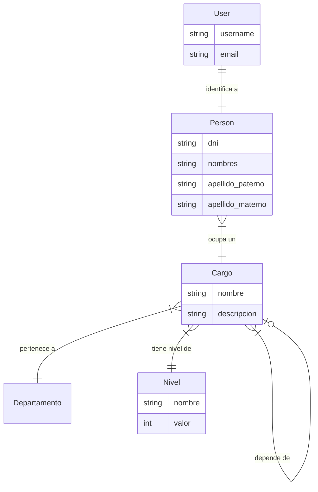

# Documentación de Arquitectura: Usuarios, Personas y Jerarquías

Este documento detalla la estructura lógica del sistema de gestión de cuentas en el proyecto **Fructidor Backend**, adaptado a las necesidades de identidad y jerarquía del contexto boliviano.

## 1. Entidades y Modelos

El sistema se basa en cuatro pilares fundamentales que separan la autenticación de la identidad personal y la autorización.

### A. User (`auth.User`)
- **Origen:** Modelo nativo de Django.
- **Propósito:** Maneja credenciales (username, password, email) y el estado de la cuenta (activo/inactivo).
- **Relación:** Tiene una relación **1:1** con `Persona`.

### B. Persona (`accounts.Person`)
- **Propósito:** Almacena los datos de identidad civil.
- **Contexto Boliviano:** 
    - **Apellidos:** Se separa en `apellido_paterno` y `apellido_materno` para cumplir con los estándares de registro civil en Bolivia (SEGIP/Sereci). El apellido materno es opcional para casos de ciudadanos extranjeros o registros específicos.
    - **DNI:** Campo único para el Carnet de Identidad o documentos de identidad.
- **Relación:** Vinculada a un `User` y a un `Cargo`.

### C. Cargo (`accounts.Cargo`)
- **Propósito:** Define la función o cargo del usuario dentro del sistema.
- **Relación:** Vinculada a un `Nivel`. Un nivel puede tener múltiples cargos asociados (ej: "Supervisor de Almacén" y "Supervisor de Ventas" podrían compartir el mismo peso jerárquico).

### D. Nivel (`accounts.Nivel`)
- **Propósito:** Define el "peso" o autoridad numérica.
- **Lógica de Negocio:** Se utiliza una convención de "Mayor es mejor" (High-weight hierarchy).

## 2. Jerarquía de Poder (Business Logic)

Los niveles están normalizados en su propia tabla para permitir flexibilidad futura sin modificar el código fuente.

| ID | Nombre | Valor | Descripción |
|---|---|---|---|
| 1 | Administrador | 100 | Acceso total y gestión de roles/usuarios. |
| 2 | Supervisor | 50 | Gestión operativa y visualización de datos. |
| 3 | Usuario | 10 | Acceso a funciones básicas del sistema. |

## 3. Diagrama de Relaciones

## 4. Implementación de Seguridad

Para la protección de rutas, se utiliza el permiso personalizado `IsManagementLevel`.

**Lógica:**
- Si `nivel.valor >= 50`, el usuario tiene permisos de **Gestión** (Administradores y Supervisores).
- Si el usuario es `is_superuser`, salta las validaciones y obtiene acceso total.

**Endpoints Protegidos:**
- Registro de nuevos usuarios.
- Creación y edición de roles.
- Gestión (CRUD) de la tabla de personas.